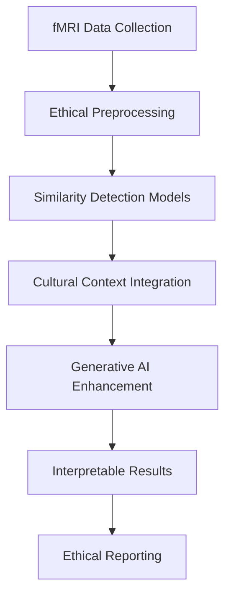

# MCP-fMRI: Ethical Analysis of Mathematical Abilities Using Generative AI

> **Performance analysis in mathematical skills with emphasis on gender similarities using fMRI neuroimaging data and generative AI techniques - focused on Japanese populations**

[](https://badge.fury.io/py/mcp-fmri)
[](https://opensource.org/licenses/MIT)
[](https://www.python.org/downloads/)
[](https://github.com/psf/black)
[](https://github.com/Tatsuru-Kikuchi/mcp-fmri-package/actions/workflows/label.yml)

## 🎯 Research Objectives

This package provides tools for investigating the neural mechanisms underlying mathematical cognition using advanced generative AI techniques applied to functional MRI (fMRI) data. **Our approach emphasizes similarities over differences** and promotes ethical AI practices in neuroimaging research.

### Primary Goals
- **Investigate neural mechanisms** underlying mathematical cognition in Japanese populations
- **Emphasize gender similarities** rather than differences in mathematical abilities
- **Apply generative AI** to enhance fMRI analysis capabilities and address small dataset challenges
- **Integrate cultural context** specific to Japanese sociocultural factors
- **Establish ethical guidelines** for AI-based gender difference research in neuroimaging

### Research Philosophy
We follow evidence-based approaches showing that gender similarities dominate mathematical cognition at the neural level, particularly in early development stages.

## 🚀 Installation

### From PyPI (Recommended)

```bash
pip install mcp-fmri
```

### From Source

```bash
git clone https://github.com/Tatsuru-Kikuchi/mcp-fmri-package.git
cd mcp-fmri-package
pip install -e .
```

### Optional Dependencies

```bash
# For neuroimaging support
pip install mcp-fmri[neuroimaging]

# For dashboard functionality
pip install mcp-fmri[dash]

# For development
pip install mcp-fmri[dev]
```

## 🔧 Quick Start

### Basic Usage

```python
from mcp_fmri import fMRIPreprocessor, GenderSimilarityAnalyzer

# Initialize preprocessor
preprocessor = fMRIPreprocessor(
    raw_data_dir="path/to/raw/data",
    output_dir="path/to/output"
)

# Preprocess data
results = preprocessor.preprocess_batch(["JP001", "JP002", "JP003"])

# Analyze gender similarities
analyzer = GenderSimilarityAnalyzer(ethical_guidelines=True)
model, history = analyzer.analyze_similarities(results)

# Generate ethical report
report = analyzer.generate_report()
print(report)
```

### Command Line Interface

```bash
# Preprocess fMRI data
mcp-fmri-preprocess --input /path/to/raw --output /path/to/processed

# Run similarity analysis
mcp-fmri-analyze --data /path/to/processed --config config.yaml
```

### Advanced Example

```python
from mcp_fmri.analysis import EthicalfMRIAnalysis
from mcp_fmri.visualization import SimilarityPlotter
from mcp_fmri.cultural import JapaneseCulturalContext

# Initialize with cultural context
cultural_context = JapaneseCulturalContext()
analysis = EthicalfMRIAnalysis(
    cultural_context=cultural_context,
    similarity_threshold=0.8,
    bias_detection=True
)

# Load and analyze data
data = analysis.load_data("preprocessed_data.h5")
results = analysis.run_similarity_analysis(data)

# Create visualizations
plotter = SimilarityPlotter()
fig = plotter.plot_brain_similarities(results)
fig.show()
```

## 📊 Key Features

### 🧠 **Neural Analysis**
- Similarity-focused fMRI preprocessing pipeline
- Gender similarity detection models
- Cultural context integration
- Bias detection and mitigation

### 🎌 **Cultural Considerations**
- Japanese educational system context
- Collectivist culture framework
- Stereotype acquisition patterns
- Regional diversity analysis

### 🤖 **Generative AI Components**
- Variational Autoencoders (VAE) for feature learning
- Data augmentation for small datasets
- Transfer learning across populations
- Synthetic data generation for validation

### 📈 **Ethical Framework**
- Similarity emphasis over differences
- Bias mitigation techniques
- Interpretability-first design
- Cultural sensitivity integration

## 🧠 Scientific Background

### Current Research Context

Recent meta-analyses and neuroimaging studies provide compelling evidence:

- **Gender similarities hypothesis**: Large-scale studies show more similarities than differences in mathematical cognition ([Hyde et al., 2008](https://science.sciencemag.org/content/321/5888/494))
- **Neural similarity findings**: fMRI studies in children (3-10 years) show no significant gender differences in mathematical brain activation ([Kersey et al., 2019](https://www.nature.com/articles/s41539-019-0057-x))
- **Cultural factors**: Japanese children may acquire gender stereotypes later than Western populations, suggesting environmental influences ([Tatsuno et al., 2022](https://www.nature.com/articles/s41598-022-20815-2))
- **Generative AI potential**: Recent advances in neuroimaging AI show promise for understanding brain function ([DuPre & Poldrack, 2024](https://direct.mit.edu/imag/article/doi/10.1162/imag_a_00241/123568))

## 📖 API Documentation

### Core Classes

#### `fMRIPreprocessor`
Handles standard fMRI preprocessing with ethical considerations.

```python
preprocessor = fMRIPreprocessor(
    raw_data_dir="/path/to/raw",
    output_dir="/path/to/output",
    motion_threshold=3.0,  # mm
    rotation_threshold=3.0,  # degrees
    smoothing_fwhm=8.0  # mm
)
```

#### `GenderSimilarityAnalyzer`
Performs ethical analysis focusing on gender similarities.

```python
analyzer = GenderSimilarityAnalyzer(
    ethical_guidelines=True,
    similarity_threshold=0.8,
    cultural_context="japanese"
)
```

#### `JapaneseCulturalContext`
Provides cultural context for Japanese populations.

```python
context = JapaneseCulturalContext(
    education_system="collectivist",
    stereotype_timing="late",
    regional_diversity=True
)
```

### Visualization Tools

```python
from mcp_fmri.visualization import (
    SimilarityPlotter,
    BrainNetworkPlotter,
    EthicalReportGenerator
)

# Create similarity plots
plotter = SimilarityPlotter()
fig = plotter.plot_similarity_matrix(similarity_data)

# Generate brain network visualizations
network_plotter = BrainNetworkPlotter()
fig = network_plotter.plot_connectivity(connectivity_matrix)

# Create ethical reports
reporter = EthicalReportGenerator()
report = reporter.generate_similarity_report(analysis_results)
```

## 🔬 Methodology

### Similarity-Focused Analysis Framework



### Technical Approach

1. **Data Preprocessing**
   - Standard fMRI preprocessing pipelines
   - Quality control with bias detection
   - Cultural demographic integration

2. **Similarity-Focused Models**
   - Variational Autoencoders (VAE) for feature learning
   - Similarity detection neural networks
   - Connectivity-based analysis

3. **Generative AI Components**
   - Data augmentation to address small sample sizes
   - Synthetic data generation for validation
   - Transfer learning across populations

4. **Ethical AI Framework**
   - Bias mitigation techniques
   - Interpretability-first design
   - Cultural sensitivity integration

## 📊 Expected Results

Based on current literature, we expect to find:
- **Minimal gender differences** in mathematical cognition neural patterns
- **High individual variability** exceeding group differences  
- **Cultural factors** influencing any observed patterns
- **Generative AI benefits** for small neuroimaging datasets

## 🎌 Cultural Considerations

### Japanese Context Factors
- **Educational system**: Emphasis on collective achievement over individual competition
- **Gender role evolution**: Changing perceptions of STEM careers for women
- **Stereotype acquisition**: Later development of gender-math stereotypes compared to Western populations
- **Collectivist culture**: Impact on individual vs. group identity in mathematical performance

## 📖 Ethical Guidelines

### Core Principles

🔸 **Similarity Emphasis**: Prioritize identification of commonalities over differences
🔸 **Bias Mitigation**: Implement technical and methodological bias reduction
🔸 **Individual Focus**: Emphasize individual variation over group generalizations
🔸 **Cultural Sensitivity**: Integrate cultural context in all analyses
🔸 **Transparency**: Ensure all methods and assumptions are clearly documented
🔸 **Non-discrimination**: Results should never justify educational or occupational discrimination

## 🧪 Testing

```bash
# Run all tests
pytest

# Run with coverage
pytest --cov=mcp_fmri

# Run specific test modules
pytest tests/test_preprocessing.py
pytest tests/test_similarity_analysis.py
```

## 🤝 Contributing

We welcome contributions that align with our ethical research principles:

1. **Fork** the repository
2. **Create** a feature branch (`git checkout -b feature/ethical-enhancement`)
3. **Commit** changes (`git commit -am 'Add similarity-focused analysis'`)
4. **Push** to branch (`git push origin feature/ethical-enhancement`)
5. **Submit** a Pull Request

### Contribution Guidelines
- All contributions must align with ethical AI principles
- Code should emphasize similarities over differences
- Documentation must include cultural considerations
- Tests should include bias detection

## 📚 Citation

If you use this package in your research, please cite:

```bibtex
@software{kikuchi2025mcpfmri,
  title={MCP-fMRI: Ethical Analysis of Mathematical Abilities Using Generative AI},
  author={Kikuchi, Tatsuru},
  year={2025},
  url={https://github.com/Tatsuru-Kikuchi/mcp-fmri-package},
  version={0.1.0}
}
```

## 📄 License

This project is licensed under the MIT License - see the [LICENSE](LICENSE) file for details.

## 🙏 Acknowledgments

- **Neuroimaging community** for open science practices
- **Ethical AI researchers** for bias mitigation frameworks
- **Japanese research institutions** for cultural context insights
- **Open source contributors** for neuroimaging tools

## 📞 Support

- **Documentation**: [https://tatsuru-kikuchi.github.io/MCP-fMRI/](https://tatsuru-kikuchi.github.io/MCP-fMRI/)
- **Issues**: [GitHub Issues](https://github.com/Tatsuru-Kikuchi/mcp-fmri-package/issues)
- **Discussions**: [GitHub Discussions](https://github.com/Tatsuru-Kikuchi/mcp-fmri-package/discussions)

---

**⚠️ Important Note**: This research emphasizes gender similarities in mathematical cognition and should not be used to justify any form of discrimination or stereotype reinforcement. All findings should be interpreted within their cultural context and with emphasis on individual differences over group generalizations.
